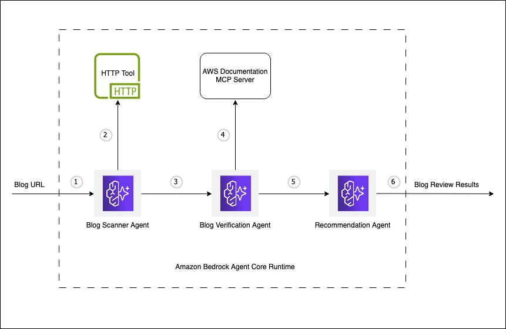

# Multi-Agent Content Reviewer

A multi-agent system for analyzing technical blog content using Amazon Bedrock AgentCore Runtime.

## Overview

Three specialized AI agents work together to identify obsolete content and generate actionable recommendations:

- **Content Scanner** - Identifies potentially outdated technical elements
- **Verification Agent** - Validates accuracy against current AWS documentation  
- **Recommendation Agent** - Generates specific update suggestions

## Quick Start

See the detailed tutorial in `content_review_runtime_notebook.ipynb` for complete setup and deployment instructions.

## Architecture

The system uses the "Agents as Tools" pattern with Strands Agents framework, deployed on Amazon Bedrock AgentCore Runtime with real-time AWS documentation access via MCP server.

